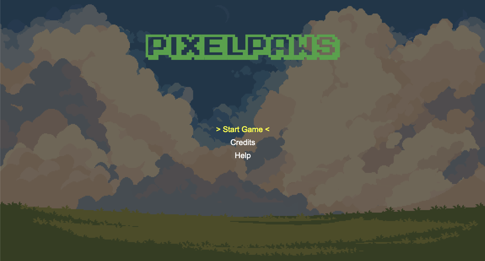

# Pixel Paws



**Pixel Paws** is an engaging platformer game built using Little.js where players control various adorable animal characters, each with unique abilities. The game features dynamic levels, exciting power-ups, and fast-paced action.

## Project Overview

Pixel Paws is a well-organized game project with separate sections for assets, characters, levels, and core game mechanics. Here's a simplified overview of the project structure:

```
.
├── LICENSE                # License file for the project
├── assets/                # All photo related game assets
│   ├── backgrounds/       # Background images for different levels
│   ├── pixel-paw.png      # Main image for Pixel Paws
│   ├── powerups/          # Images for various power-ups (health, speed, etc.)
│   └── startscreen.png    # Image for the game's start screen
├── characters/            # JavaScript files defining character behaviors
│   ├── Bear.js            # Logic for the Bear character
│   └── basePlayer.js      # Base class for all player characters
├── game/                  # Game mechanics and logic
│   ├── gameUI.js          # Handles the game UI (score, health, etc.)
│   └── levelManager.js    # Manages the game levels and transitions
├── levels/                # Level data and enemy logic
│   ├── level1.js          # Data for level 1 (platforms, enemies, etc.)
│   └── enemy.js           # Defines enemy types and their behavior
├── sprites/               # Sprite images for characters and objects
│   ├── bear/              # Sprites for the Bear character
│   └── coin.PNG           # Coin sprite image
├── src/                   # Core engine files for rendering, input handling, etc.
│   ├── engine.js          # Core game engine logic
│   └── engineDraw.js      # Handles rendering of objects and characters
└── game.js                # Main game logic and entry point

```

### Key Folders and Files

- **`assets/`**: Contains all game images and resources, including backgrounds, power-ups, and sprites.
- **`characters/`**: Holds the logic for the different playable characters and their behaviors.
- **`game/`**: Contains game mechanics like the user interface and level management.
- **`levels/`**: Contains level data and logic, including the definition of enemies, platforms, and power-ups.
- **`sprites/`**: Stores all sprite images for characters, objects, and effects.
- **`src/`**: Holds the core engine files responsible for rendering, input handling, and more.

---

## How to Run the Game

To run the game locally:

1. Clone this repository:
   ```bash
   git clone https://github.com/omerdduran/PixelPaws.git
   cd PixelPaws
   ```

2. Open `index.html` in your browser, or use a local server, use the VS Code Extension named: LiveServer for easier deployments

3. Visit `http://localhost:5500` to play the game.

---

## Credits

**Pixel Paws** is created by:

- **Ömer Duran**
- **Furkan Ünsalan**

Special thanks to [GitHub repositories](https://github.com/omerdduran/PixelPaws) for their contribution to the open-source community.

You can find our personal GitHub profiles below:

- [Ömer Duran's GitHub](https://github.com/omerdduran)
- [Furkan Ünsalan's GitHub](https://github.com/furkanunsalan)

---

## Help and Gameplay Instructions

### Controls:

- **Arrow Keys**: Move Left/Right
- **W**: Jump
- **Space Bar**: Attack/Interact
- **Q**: Special Ability
- **Esc**: Pause/Return to Menu

### Power-ups:

- **Health Pack**: Restores health.
- **Invincibility**: Makes you invulnerable for a short time.
- **Jump Boost**: Increases your jump height.
- **Speed Boost**: Increases your movement speed.

### Enemies:

- **Bear**: Strong but slow.
- **Parrot**: Aerial enemy that attacks from above.
- **Turtle**: Defensive, can block attacks.

---

## Repo Activity


## Contributing
Contributions, issues, and feature requests are welcome. Feel free to check issues page if you want to contribute.

[](https://github.com/omerdduran/PixelPaws)

[](https://star-history.com/#omerdduran/PixelPaws)

## License

This project is licensed under the GNU License - see the [LICENSE](LICENSE) file for details.